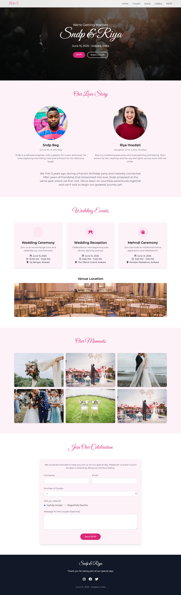

# 💍 Beautiful Wedding Website



## 📝 Project Description

This is a modern, responsive, and beautiful single-page wedding website template. It's built using HTML, Tailwind CSS, and JavaScript. This website provides a complete web solution for weddings - from sharing wedding details to guest RSVPs.

## ✨ Features

- **Fully Responsive Design**: Looks beautiful on all devices (mobile, tablet, desktop)
- **5 Well-Structured Sections**: Home, Couple, Events, Gallery, and RSVP
- **Modern UI with Tailwind CSS**: Elegant pink theme with smooth animations
- **Optimized Images**: High-quality wedding images with proper sizing
- **Interactive Elements**: Smooth scrolling navigation, hover effects, and form validation
- **Easy to Customize**: Well-commented code for easy modifications
- **Cross-Browser Compatible**: Works on all modern browsers
- **Lightweight & Fast**: Optimized for performance
- **Font Awesome Icons**: Beautiful icons throughout the design
- **Custom Fonts**: Elegant typography with Google Fonts

## 🚀 Live Demo

[View Demo](https://sndpbag.github.io/Beautiful-Wedding-Website/)

## 📷 Screenshots

### Home Section


### Couple Section


### Events Section


## 🛠️ Technologies Used

- HTML5
- CSS3 (Tailwind CSS Framework)
- JavaScript (Vanilla)
- Font Awesome Icons
- Google Fonts

## ⚙️ Installation & Setup

1. **Clone the repository**
   ```bash
   git clone https://github.com/sndpbag/Beautiful-Wedding-Website.git
   cd wedding-website
   ```

2. **Open in browser**
   - Simply open the `index.html` file in your preferred browser

3. **For development**
   - If you want to modify the Tailwind CSS styles, you'll need Node.js installed
   - Install dependencies:
     ```bash
     npm install
     ```
   - Start the development server:
     ```bash
     npm run dev
     ```

## 🔧 Customization Guide

### Basic Information
- Edit the couple's names, dates, and venue information in the HTML file
- Replace placeholder images with your own wedding photos
- Update event details and schedule

### Colors and Theme
- The primary color scheme uses pink tones which can be modified in the CSS
- Tailwind CSS makes it easy to change colors by modifying class names

### Content Sections
- Each section is clearly marked in the HTML with comments
- Add or remove sections as needed for your wedding

## 📋 Project Structure

```
wedding-website/
├── index.html              # Main HTML file
├── assets/
│   ├── css/                # CSS files
│   ├── js/                 # JavaScript files
│   └── images/             # Image files
├── README.md               # Project documentation
└── LICENSE                 # License information
```

## 🤝 Contributing

Contributions, issues, and feature requests are welcome! Feel free to check the [issues page](https://github.com/your-username/wedding-website/issues).

1. Fork the project
2. Create your feature branch (`git checkout -b feature/amazing-feature`)
3. Commit your changes (`git commit -m 'Add some amazing feature'`)
4. Push to the branch (`git push origin feature/amazing-feature`)
5. Open a Pull Request

## 📝 License

This project is [MIT](LICENSE) licensed.

## 🙏 Acknowledgements

- [Tailwind CSS](https://tailwindcss.com/)
- [Font Awesome](https://fontawesome.com/)
- [Google Fonts](https://fonts.google.com/)
- [Unsplash](https://unsplash.com/) for the beautiful wedding images

## 📞 Contact

If you have any questions or feedback, please reach out:

- Your Name - [sandipan735@gmail.com](mailto:sandipan735@gmail.com)
- GitHub: [@sndpbag](https://github.com/sndpbag)
- LinkedIn: [sandipan kr bag](https://www.linkedin.com/in/sndpbag/)

---

### 💖 Happy Wedding Day!

Made with love for couples celebrating their special day.